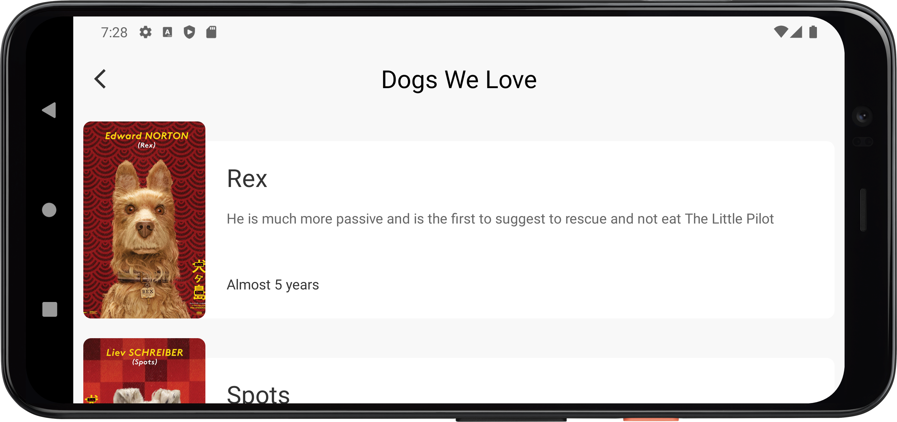

# Dogos
This application has been developed in order to complete the coding challenge provided by Konfio.

## Description
Dogos is a small android application that allows users to see data about cool dogos. 
This app has been developed using Kotlin for android and some other interesting libraries like:

1. [Volley](https://developer.android.com/training/volley?hl=es-419#:~:text=Volley%20es%20una%20biblioteca%20HTTP,autom%C3%A1tica%20de%20solicitudes%20de%20red): allows us to do different things but for this project it allows us to make requests to an API in a simpler way.
2. [Fresco](https://frescolib.org/): It is a really amazing library that allows us to display images in android apps, it is really simple to use and very powerful.

## Architecture
As the app is very simple is pretty hard to try to create some complex things, but as we already known maybe all the android apps by itself use the Model View Controller architecture. I used to describe this architecture in the next way:
- Model: Data classes. For this particular case I am using the data class called *Dog*.
- View: Visual classes. Everything that a user can see. For android apps I used to crearte *XML* files to create the *UI* in this particular case we have three different layouts for this category: *activity_main.xml*, *card_view_item.xml*, *toolbar.xml*
- Controller: A very informal way to describe controller is thinking that it is the glue between Model and View. It takes the data from the Model and sends this data to the View and users can see the result. In this case we have all the classes that are *Fragments* or *Activities* because all of them use both things. In this particular case we have the *MainActity.kt*

### Functionality
I have created a data flow diagram to show you more or less the functionality of this app it includes the use of a data base, and network request.

## Design
This application is possible tu use it in different android devices for this case I wrote this app to work properly in different screen sizes, let's see a couple of examples:

|Pixel 4|Nexus 4|
|-------|------|
|||

Of course this app looks really well using the landscape configuration of the app too.

|Pixel 4|Nexus 4|
|-------|------|
|||

Something that maybe can be improved is to use two columns for landscape configuration because horizontally we have more space available so we can take advantage of that and display more information in the same space and why not add support for dark theme too.

## Network request
As I already mentioned in the description I used a library called volley to make requests. As I already built previouslly some android apps I known that it is possible to use http requests to face this point, but in order to make even easier to complete this point I decided to use an external library. The code realated with make a *Network Request* can be found in classes: *FetchDataUtils.kt*, *FetchDataConstants.kt* and *RequestManager.kt*.

## Data Base
Fortunatelly Google has a lot of documentation about how to create android apps and in that documentation we can find some information about *SQLite*. *SQLite* is a software library that provides a relational database management system. If I am not making a mistake this library has been used by Google for several years and it works really well. The clases that I created to use a data base are: *DogsContract.kt* (basically the schema), *DogsReaderDbHelper.kt* (creates and implements a data base into our app) and last but not least *DogsDB.kt* it is the class that use all the functionalities of the data base store data and ask for data, if it is required to add more interesting features to the app and we need to use the operations *update*, *delete*, etc. It is the class that you can modify.

## Testing
Unfortunatelly are a lot of developers that usually does not write test but it helps us to create a really great quality software. For this coding challenge I just wrote *Unit Tests*. *Unit Tests* allows to test every piece of code individually, it is really great because we can known if our code is working as we expected. All the code related with tests is located into `app > src > test > java > com > erick > dogos`. Talking about numbers I wrote 17 Unit Test for this app trying to check everything as possible.
